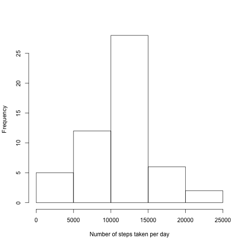
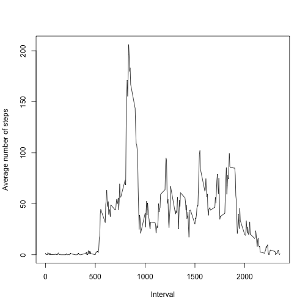
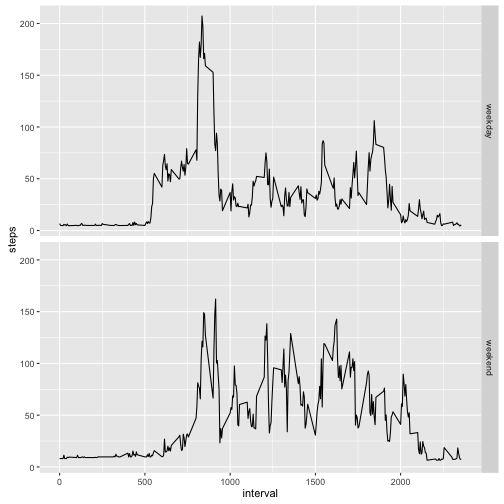

# What is mean total number of steps taken per day?

The mean total number of steps taken per day is 37.3825996, while the median is 0.

# What is the average daily activity pattern?

On average, the 835 interval contains the maximum number of steps.

# Imputing missing values

In total there are 2304 missing values in the dataset. Missing values have been imputed with the average value for that interval. In this augmented dataset the mean total number of steps taken per day is 37.811803, while the median is 0. There is a minimial effect of imputing the missing data on the mean and median of the total number of steps taken per day.

# Are there differences in activity patterns between weekdays and weekends?

Looks like people sleep in on weekends: there is more activity in the earlier intervals on weekdays.
